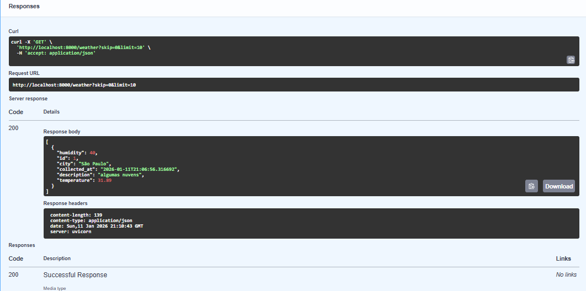

# 🌦️ Weather Data ETL & API Challenge


Este projeto é uma solução completa de **Engenharia de Dados, Backend e Cloud-Native Applications**, desenvolvida como parte de um desafio técnico.

O objetivo é demonstrar competências em **extração de dados (ETL)**, **armazenamento relacional**, **desenvolvimento de APIs RESTful** e **orquestração de infraestrutura com Docker**.

---

## 📋 Arquitetura da Solução

A aplicação foi desenhada seguindo o padrão de **serviços conteinerizados**, priorizando a separação de responsabilidades e a reprodutibilidade do ambiente.

O fluxo de dados funciona da seguinte maneira:

1.  **Extração (ETL):**
    Ao iniciar a aplicação, um processo independente executa a extração de dados climáticos consumindo a API da OpenWeatherMap.

2.  **Transformação e Armazenamento:**
    Os dados são tratados, normalizados e persistidos em um banco de dados **PostgreSQL**, garantindo integridade e consistência.

3.  **Exposição via API:**
    Uma API desenvolvida em **FastAPI** disponibiliza os dados armazenados por meio de endpoints HTTP documentados.

4.  **Infraestrutura:**
    Toda a solução é orquestrada via **Docker Compose**, garantindo que a aplicação e o banco de dados subam na mesma rede, na ordem correta e de forma totalmente reproduzível.

> 🔎 **Observação:**
> Embora o ETL e a API estejam no mesmo container por simplicidade de entrega, o ETL é executado como um **processo independente**, respeitando o princípio de **separação de responsabilidades**.

---

## 🗄️ Modelo de Dados

A tabela principal (`weather_logs`) armazena as informações climáticas normalizadas:

| Coluna | Tipo | Descrição |
| :--- | :--- | :--- |
| `id` | Integer | Chave primária |
| `city` | String | Nome da cidade consultada |
| `temperature` | Float | Temperatura em graus Celsius |
| `humidity` | Integer | Umidade relativa do ar (%) |
| `description` | String | Descrição do clima (ex: "céu limpo") |
| `collected_at` | DateTime | Timestamp da coleta |

---

## 🚀 Como Executar o Projeto

### Pré-requisitos
* Docker e Docker Compose instalados.
* Uma chave de API gratuita da [OpenWeatherMap](https://openweathermap.org/).

### Passo a Passo

1.  **Clone o repositório:**
    ```bash
    git clone [https://github.com/VictorTavaresRafael/weather-challenge.git](https://github.com/VictorTavaresRafael/weather-challenge.git)
    cd weather-challenge
    ```

2.  **Configure as Variáveis de Ambiente:**
    Crie um arquivo chamado `.env` na raiz do projeto e preencha com suas credenciais seguindo o modelo abaixo:

    ```env
    OPENWEATHER_API_KEY=sua_chave_aqui
    DATABASE_URL=postgresql://user:password@db:5432/weatherdb
    POSTGRES_USER=user
    POSTGRES_PASSWORD=password
    POSTGRES_DB=weatherdb
    ```

3.  **Suba a aplicação:**
    ```bash
    docker-compose up --build
    ```

---

## 📚 Documentação da API

A documentação interativa é gerada automaticamente pelo Swagger UI. Após subir os containers, acesse:

* **Swagger UI:** [http://localhost:8000/docs](http://localhost:8000/docs)
* **Redoc:** [http://localhost:8000/redoc](http://localhost:8000/redoc)

### Demonstração de Uso

**1. Verificação de Status (Health Check):**
Confirmação de que a API está online e funcional.


**2. Consulta de Dados Climáticos (GET /weather):**
Retorno dos dados processados pelo ETL e persistidos no banco de dados.


---

## 🛠️ Decisões Técnicas

As escolhas tecnológicas foram baseadas em performance, robustez e facilidade de manutenção:

* **FastAPI:** Escolhido pela alta performance (assíncrono), validação de dados nativa (Pydantic) e geração automática de documentação.
* **SQLAlchemy:** Utilizado como ORM para abstração do banco de dados, facilitando migrações e prevenindo SQL Injection.
* **Docker Compose:** Garante que o ambiente de execução seja idêntico em qualquer máquina (dev/prod), eliminando o problema de "funciona na minha máquina".
* **Variáveis de Ambiente (.env):** Implementadas para garantir a segurança de credenciais sensíveis (12-Factor App methodology).

---

## 🔮 Melhorias Futuras

Pontos de evolução identificados para as próximas iterações:

* [ ] Implementação de Testes Unitários (Pytest).
* [ ] Agendador de tarefas (Cron/Celery) para execução periódica do ETL.
* [ ] Implementação de Cache (Redis) para reduzir carga no banco em leituras frequentes.
* [ ] Separação do ETL em um microserviço dedicado.

---

**Desenvolvido por Víctor Matheus Tavares Rafael**